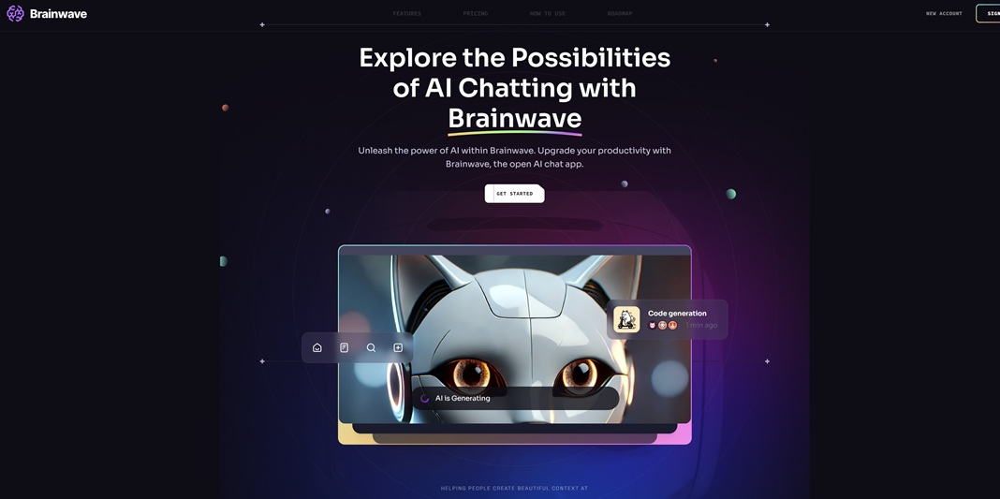

# React + Vite

<h3> React project powered by Vite for fast development and performance. </h3>

Features
- React: A JavaScript library for building user interfaces.
- Vite: A lightning-fast build tool for modern web projects.
- Tailwind CSS: Utility-first CSS framework for styling.

## Images

 
     
     

# Sources:

<a href="https://vitepress.dev" target="_blank">Vitepress</a>

<a href="https://tailwindcss.com" target="_blank">Tailwind CSS</a>

# Installation needed

npm install scroll-lock
npm install react-just-parallax

## Source for free PNG

<a href="https://www.freepik.com" target="_blank">freepik.com</a>
